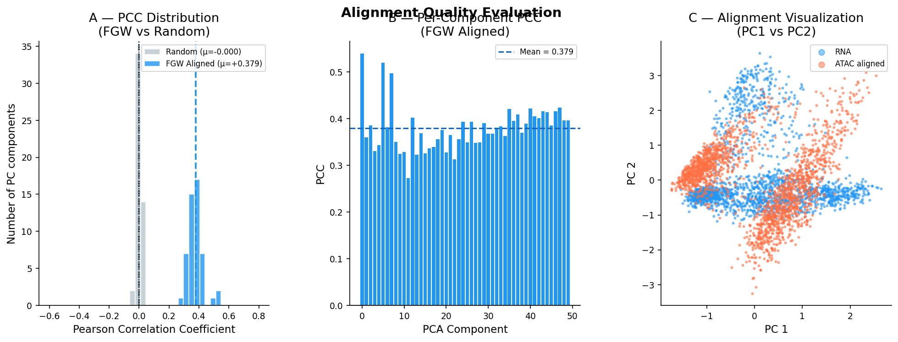
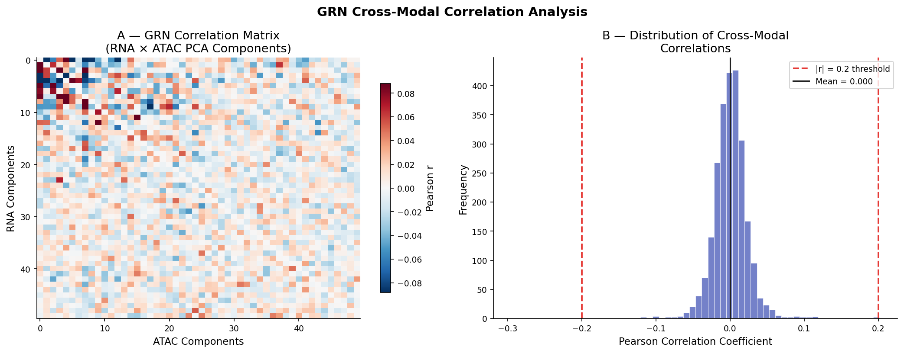
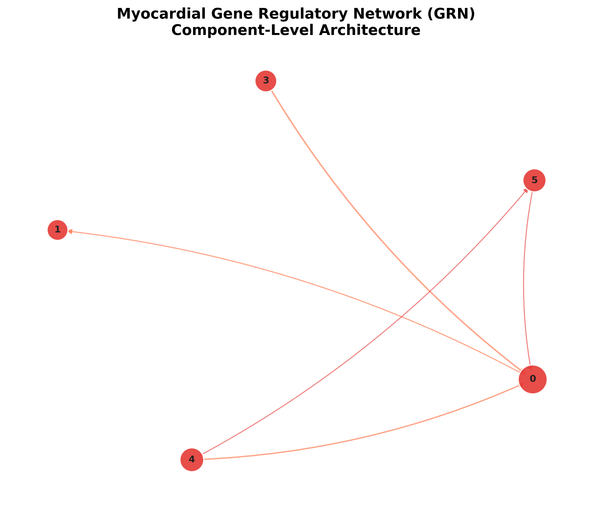

# Single-Cell Multi-Omics Integration with Fused Gromov-Wasserstein Optimal Transport

Can we match gene expression (RNA) and chromatin accessibility (ATAC) data from **different cells** of the human heart?
This project aligns **unpaired** snRNA-seq and snATAC-seq data from human myocardial tissue using **Fused Gromov-Wasserstein (FGW) optimal transport**, then builds a component-level gene regulatory network (GRN).

**Course:** INFO-B 528 Computational Analysis of High-Throughput Biomedical Data, Indiana University Indianapolis (2026)
**Author:** Geethanjali Karuturi

---

## Key Results

| Metric | Value |
|---|---|
| Cells per modality (subsampled) | 5,000 |
| Shared genes | 17,804 |
| FGW-aligned mean PCC (50 PCs) | **+0.379** |
| Random baseline mean PCC | −0.0004 |
| PCs with positive PCC | 50 / 50 (range ≈ 0.27–0.55) |
| Hub components in GRN | 5 |

Hub components matched known heart cell programs:

| Component | Top genes | Biological program |
|---|---|---|
| C0 | BICC1, EBF1, COL6A3, FBN1, GLIS3 | Cardiomyocyte / developmental |
| C1 | VWF, FLT1, EMCN, PECAM1, EGFL7 | ECM / stromal–endothelial |
| C3 | KALRN, INSR, HSPG2, WWTR1 | Vascular signaling |
| C4 | COL1A1, COL1A2, COL3A1, MEF2C | Fibrosis / ECM remodeling |
| C5 | PDGFRB, NOTCH3, EGFLAM, GUCY1A2 | Smooth muscle / pericyte |





---

## Workflow

```
snRNA-seq + snATAC-seq (human myocardial infarction atlas)
        ↓
Subsample 5,000 cells per modality, keep 17,804 shared genes
        ↓
Normalize (10,000 counts) + log1p, 5,000 highly variable genes (Scanpy)
        ↓
PCA (50 components) + standardize each modality
        ↓
Fused Gromov-Wasserstein optimal transport (POT, alpha = 0.5)
        ↓
Barycentric projection of ATAC cells into RNA space
        ↓
Evaluate: mean Pearson correlation vs. random permutation baseline
        ↓
50 × 50 cross-modal correlation matrix → GRN (|r| > 0.2, NetworkX)
        ↓
Hub components (weighted degree) → annotate with top PCA gene loadings
```

---

## Repository Structure

```
single-cell-multiomics-fgw-integration/
├── notebooks/
│   └── fgw_multiomics_integration.ipynb   # full analysis with outputs
├── figures/                               # key result figures
├── requirements.txt
├── LICENSE
└── README.md
```

---

## Data

Data is **not stored** in this repo because of its size. Sources:

- CELLxGENE: https://cellxgene.cziscience.com/collections/8191c283-0816-424b-9b61-c3e1d6258a77
- Zenodo: https://zenodo.org/record/6578553 and https://zenodo.org/record/6578617

## How to Run

1. Download the data and save the files as `data/snrna.h5ad`, `data/snatac.h5ad`, and `data/spatial.h5ad`.
2. Install packages: `pip install -r requirements.txt`
3. Open `notebooks/fgw_multiomics_integration.ipynb` in Jupyter and run all cells.
   Note: the FGW step builds 5,000 × 5,000 distance matrices, so it needs a lot of memory (an HPC node is recommended).

## Tools

Python · Scanpy · Python Optimal Transport (POT) · scikit-learn · NetworkX · NumPy · Pandas · Matplotlib

## Limitations

- The data is unpaired, so the alignment cannot be checked against true cell-to-cell matches.
- Subsampling to 5,000 cells may miss rare cell types.
- The GRN is small (5 nodes, 5 edges) and depends on the |r| > 0.2 cutoff.
- The POT solver reported reaching its iteration limit, so convergence is not fully confirmed.
- Only compared against a random baseline, not other integration methods (e.g., Seurat, ArchR).

## Acknowledgments

ChatGPT was used for help organizing content, and Grammarly for improving clarity.
